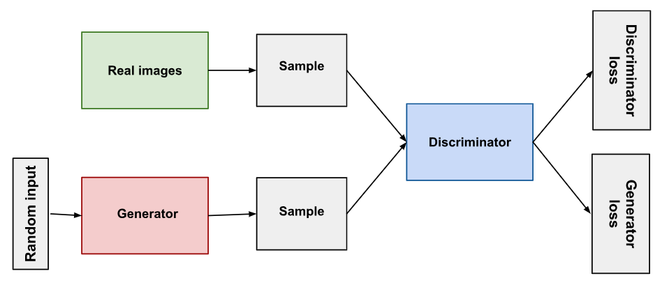
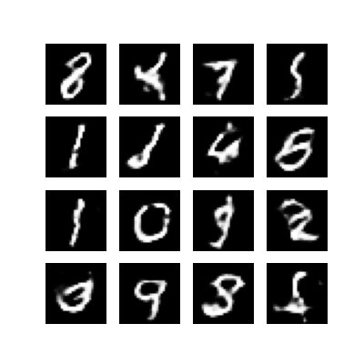
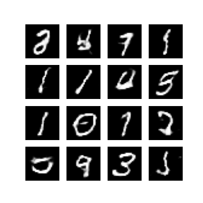
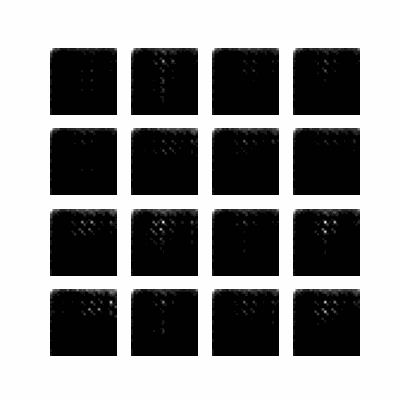

# GAN_from_Scratch
**Generative Adversarial Network** for MNIST Dataset `(digit generation)` using TensorFlow



## Table of Contents
1. [Project Overview](#project-overview)
2. [Installation](#installation)
3. [Dataset](#dataset)
4. [Model Architecture](#model-architecture)
5. [Training](#training)
6. [Results](#results)
7. [Future Improvements](#future-improvements)
8. [Contributing](#contributing)
9. [License](#license)

## Project Overview
This project demostrates how to implement and train a basic Generative Adversarial Network (GAN) using MNIST dataset of handwritten digits. The GAN consists of two neural networks:
* **Generator** : This network generates fake images based on random noise (latent vectors).
* **Discriminator** : This network tries to distinguish between real images (MNIST dataset) and fake images generated by the Generator.

Both networks are trained in such a manner that Generator tries to fool the Discriminator, and the Discriminator learns to improves its accuracy.
By end of training, the Generator produces realistic handwritten digits that are indistinguishable from real MNIST images.


## Installation
1. 'Clone the Repository'
 
   First, clone this repository to your local machine:
   ```bash
   git clone https://github.com/adiManethia/GAN_from_Scratch.git
   cd GAN_from_Scratch
   ```
2. 'Install Dependencies'
 
   Install the required dependencies using pip:
   ```bash
   pip install -r requirements.txt
   ```
   Alternatively, you can install the dependencies manually.

## Dataset
We use the [MNIST dataset](http://yann.lecun.com/exdb/mnist/) of handwritten digits, which contain 60,000 training images and 10,000 test images. Each image is 28x28 pixels in grayscale. TensorFlow automatically downloads the MNIST datset through its `datasets` API.
The images are normalized to the range `[-1,1]`, for better performance with the `tanh` activation function used in the Generator.
```python
(train_images, train_labels), (_, _) = tf.keras.datasets.mnist.load_data()
```

## Model Architecture
1. 'Generator'
   
   The Generator network takes a random noise vector (latent vector) as input and generates a fake MNIST image. It uses series of `Dense`, `BatchNormalization`, and `Conv2DTranspose` layers to upsample the noise vector into a realistic image.

   key Layers:
   * Dense layer to expand noise to 7x7x256.
   * Conv2DTranspose layers with strides to upsample the image to 28x28.
   * LeakyReLU and `tanh` for activation.
   ```python
   model.add(layers.Dense(7*7*256, use_bias=False, input_shape=(100,)))
   model.add(layers.BatchNormalization())
   model.add(layers.LeakyReLU())
   ```
3. 'Discriminator'
   
   This network takes an image (fake or real) as input and outputs a binary classification (0/1). It uses a series of `Conv2D` layers followed by a `Flatten` and a `Dense` layer.

   Key Layers:
   * conv2D layers for downsampling.
   * LeakyReLU activation.
   * Dropout for regularization to prevent overfitting.
   ```python
   model.add(layers.Conv2D(64, (5,5), strides=(2,2), padding='same'))
   model.add(layers.LeakyReLU())
   model.add(layers.Dropout(0.3))
   ```

## Training
### Training Process
The GAN is trained for a fixed number of epochs. In each epoch:
* Generator: It produce fake images from random noise vectors.
* Discriminator: it attemps to classify real images (from MNISt datset) and fake images (from the Generator)
* Loss Function:
   * Generator loss: Measures how well the Generator can fool the Discriminator.
   * Discriminator loss: Measures how well the Discriminator can distinguish between real and fake images.

### Optimizers
Both the Generator and Discriminator are optimized using 'Adam' optimizer with learning rates `lr=0.0001` for stable training.
```python
generator_optimizer = tf.keras.optimizers.Adam(1e-4)
discriminator_optimizer = tf.keras.optimizers.Adam(1e-4)
```
### Checkpoints
Checkpoints are saved during training to allow the model to be restored and avoid losing progress.
```python
checkpoint = tf.train.Checkpoint(generator_optimizer = generator_optimizer, discriminator_optimizer = discriminator_optimizer, generator = generator, discriminator  = discriminator)
```
## Results
After training for several epochs (100 in this case), the Generator is able to produce images that resemble real handwritten digits. Below are some example outputs generated by the model after 50, 100, and 200 epochs:
<p float="left">
   
   
</p>
   
## Operation
1. Train the GAN
2. Generate Images
   Here, we will load the trained model from checkpoints and generate new handwritten digits.
   ```python
   generate_images(generator_trained)
   ```
3. Create a GIF
   We can create a GIF of the generated images over time. Here is an example -
   
   
## Future Improvements
Some potential future improvements for the project include:
* Training the GAN on larger, more complex datasets.
* Experimenting with different GAN architectures.
* Adding evaluation metrics to assess the quality of generated images.
* Deploying the model as an interactive web application using Streamlit or Flask.

## Contributing
Contributions are welcome! Please fork the repository and submit a pull request for any changes or improvement you'd like to make. Please follow the steps outlined below.
1. Fork the project
2. Create your feature branch (git checkout -b feature/NewFeature)
3. Commit your changes (git commit -m 'Add some NewFeature')
4. Push to the branch (git push origin feature/NewFeature)
5. Open a pull request

## License
This project is licensed under the MIT License. See the [LICENSE](license) file for detail.


-------------------------------------------------------------------------------------------------------------------------------------

This README file serves as a detailed guide for the GAN project, providing a comprehensive explanation for anyone looking to understand the project structure, setup, and usage. You can customize it further based on your specific needs, results, and repository structure!

  

